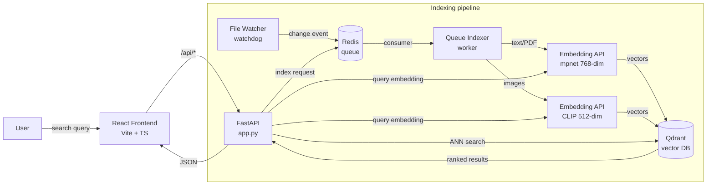

# FindLy

<!-- > **Semantic file search for your local machine.** -->
> Find files by what they *mean*, not what they're named.


<!--https://github.com/user-attachments/assets/a92e7440-6cf5-49bc-b884-1f7f1e9ffcce -->

---

## What it does

Traditional file search needs you to know what the file is called. FindLy
needs you to know what it's *about*.

Type `dessert recipe` and it finds your chocolate cake note — even though
the file never says "dessert." Type `cozy coffee shop` and it surfaces the
photo of a café you saved last month — even though you never tagged it.
Type `how do vector databases work` and it pulls up the white paper you
forgot you had.

Under the hood, FindLy embeds the contents of every file into a shared
vector space. Text and PDFs go through a sentence-transformer
(`all-mpnet-base-v2`, 768-dim). Images go through CLIP (512-dim). Search
queries are embedded the same way, and the system retrieves whatever
lives closest to your query in that space.

### Example queries that "shouldn't" work — but do

| You type | FindLy returns | Why it's interesting |
|---|---|---|
| `dessert recipe` | `chocolate-lava-cake.md` | File never says "dessert" |
| `container orchestration` | `kubernetes-cheatsheet.md` | File says "k8s", "pod" — never "orchestration" |
| `trip to japan` | `tokyo-seven-days.md` | File says "Tokyo", never "Japan" |
| `cozy place to work from` | `coffee-shop.jpg` | Pure visual match via CLIP |
| `morning coffee at home` | `home-espresso.pdf` | File never says "morning" or "coffee" |

---

## Features

- **Two-space semantic search.** Text/PDFs via sentence-transformers,
  images via CLIP. One query searches both spaces and merges results by
  normalized score.
- **Live re-indexing.** A file-system watcher detects changes and
  re-embeds modified files automatically. Manual reindex available from
  the UI for stale results.
- **In-app preview.** Click any result for a modal preview — images
  render inline, PDFs support page navigation, text/code files show
  syntax-aware excerpts.
- **File-type filtering.** Narrow to Documents, PDFs, Images, Code,
  or plain Text. The result list re-ranks instantly without re-querying
  the embedding service.
- **Themed UI.** Dark frosted-glass aesthetic with custom confirmation
  modals, hover-reveal actions, animated indexing progress.
- **One-command stack.** `docker compose up -d --build` brings up
  five services and the frontend in under a minute.

---

## Tech Stack

| Layer | Stack |
|---|---|
| **Frontend** | React 19, TypeScript, Vite, Lucide icons |
| **API** | FastAPI, Pydantic |
| **Indexing worker** | Python, file-watchdog, Redis Streams |
| **Embeddings** | sentence-transformers (`all-mpnet-base-v2`), OpenAI CLIP (`clip-vit-base-patch32`) |
| **Vector store** | Qdrant (HNSW index, separate collections per embedding space) |
| **Queue / cache** | Redis |
| **Deployment** | Docker Compose (frontend, FastAPI, embedding service, queue worker, file watcher, Qdrant, Redis) |

---

## Architecture



A search query is embedded twice (text and CLIP spaces), each space is
queried in parallel, results are normalized to a common scale, and the
merged list is sent back to the frontend.

---

## Quick Start

### Prerequisites

- [Docker Desktop](https://www.docker.com/products/docker-desktop/) with
  at least **6 GB of memory** allocated to the engine (the embedding
  model needs ~1.5 GB resident — under-provisioned Docker installs will
  OOM during model load).

### 1. Configure the host mount

FindLy needs a read-only view of your home directory so the indexer can
see your files.

```bash
cd backend_2
# macOS / Linux:
cp .env.mac.example .env
# Windows (PowerShell):
copy .env.windows.example .env
```

The `.env` file declares `HOST_USERS_PATH` — `/Users` on macOS,
`C:/Users` on Windows. Docker Compose will refuse to start without it.

### 2. Bring up the stack

```bash
docker compose up -d --build
```

This boots the frontend, the FastAPI app, the embedding API, Qdrant,
Redis, the queue indexer worker, and the file watcher. First boot
takes 3–5 minutes (model download + image builds). Subsequent boots
are seconds.

### 3. Open the app

```
http://localhost:5173
```

Use the left side panel to pick the folders you want to index, hit
**Actions → Index Selected**, wait for the progress bar to finish, then
search.

### Stopping the stack

```bash
docker compose down
```

---

## How It Works

### Indexing

1. The user selects a folder in the side panel and triggers indexing.
2. The FastAPI app walks the directory tree, classifies each file by
   extension and MIME (text / code / pdf / image / binary), and pushes a
   per-file job onto a Redis queue.
3. A worker pops jobs, reads file contents, runs them through the right
   embedding service, and upserts the resulting vectors into Qdrant with
   metadata (path, kind, size, hash, indexed_at).
4. The file watcher runs in parallel — when any indexed file changes on
   disk, it re-queues the file for embedding so search results never go
   stale.

### Searching

1. The query is embedded twice — once with mpnet (text space) and once
   with CLIP (image space).
2. Each embedding hits Qdrant in parallel with file-kind filters
   derived from the UI filter chips.
3. Results from both spaces are normalized to `[0, 1]` against their own
   max score (so a `text → text` 0.7 isn't unfairly outranked by a
   `text → image` 0.95) and merged.
4. The merged list is returned to the frontend, which renders cards
   with previews, scores, and reindex affordances.

### Re-indexing

Three entry points, all funneling into the same job system:

- **Per result card** — hover a search result, click the refresh icon.
- **Per tree node** — right-click any indexed file or folder.
- **Bulk** — Actions menu → Reindex Selected (counts indexed files in
  the current selection, disables when zero).

---

## Project Structure

```
FindLy/
├── frontend/                  # React + TypeScript + Vite
│   ├── src/
│   │   ├── api/               # Typed API client for the FastAPI backend
│   │   ├── components/
│   │   │   ├── search/        # SearchBar, ResultsList, FileTypeFilter
│   │   │   ├── layout/        # SidePanel, IndexingProgress
│   │   │   ├── preview/       # FilePreviewModal (image / PDF / text)
│   │   │   ├── common/        # ConfirmModal (danger / success variants)
│   │   │   └── backgrounds/   # Animated background effects
│   │   └── types/
│   └── vite.config.ts         # /api → Docker backend proxy
│
├── backend_2/                 # Python services
│   ├── app.py                 # FastAPI entrypoint (search, index, preview, reset)
│   ├── embedding_helper.py    # Wrappers for mpnet + CLIP
│   ├── redis_queue_indexer.py # Worker that consumes the index queue
│   ├── file_watcher.py        # Watchdog-based reindex trigger
│   ├── qdrant_helper.py       # Vector DB client + collection management
│   ├── search_helper.py       # Query embedding + ANN search + merging
│   ├── config.py              # Embedding dims, hostnames, collection names
│   └── docker-compose.yml     # Full stack definition
│
└── README.md
```

---

## Demo Content

A `findly-demo/` sample set is available with recipes, travel notes, code
samples, technical PDFs, and images chosen to highlight semantic search
across topic clusters. Point the indexer at it for a self-contained demo.

---

## Roadmap

- Document filter support for `.docx` and Office formats beyond preview
- Hybrid search (BM25 + semantic) for exact-match queries like filenames
- Cross-encoder re-ranking pass for the top-K results
- Per-user collections and access control
- Linux installer (currently Docker-only)

---

## Troubleshooting

**Search returns 500 with a dimension-mismatch error.**
The Qdrant collection schema doesn't match what the embedding model is
producing. Reset and re-index:

```bash
curl -X POST http://localhost:8000/api/reset-all
```

Then trigger indexing again from the UI.

**Embedding API container won't start (Windows).**
Docker Desktop's WSL2 backend defaults to a 2 GB memory cap, which is
not enough to load mpnet. In Docker Desktop → Settings → Resources,
raise WSL2 memory to at least 6 GB and restart Docker.

**Qdrant shows `unhealthy` in `docker compose ps`.**
The healthcheck false-positives on some Docker Desktop installs even
when the service is fully functional. Verify with:

```bash
curl http://localhost:8000/api/qdrant/health
```

---

## Acknowledgments

Built by a team of students at the **University of Southern California**. Thanks to everyone on the team who contributed to the backend pipeline, indexing infrastructure, and frontend experience.

Embedding models:
- [all-mpnet-base-v2](https://huggingface.co/sentence-transformers/all-mpnet-base-v2) by Microsoft / sentence-transformers
- [CLIP ViT-B/32](https://huggingface.co/openai/clip-vit-base-patch32) by OpenAI

Vector database: [Qdrant](https://qdrant.tech/)
